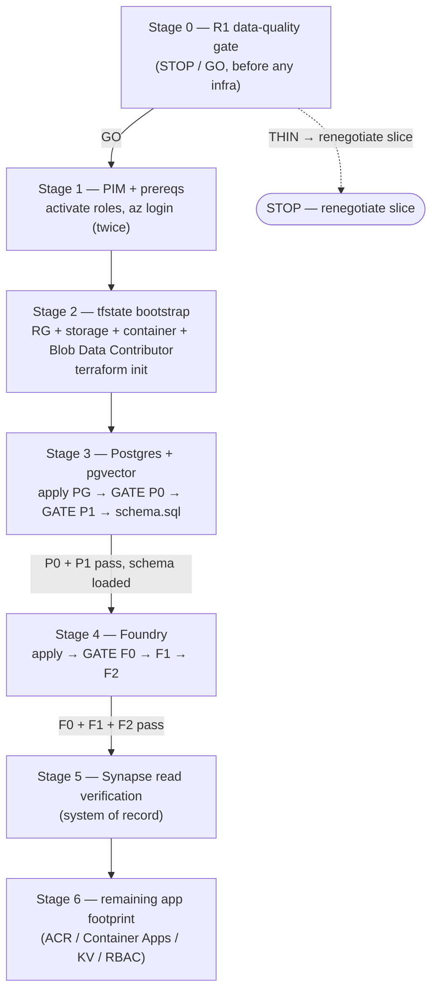

# Lot Genius PoC — Deploy Runbook

Ordered, top-to-bottom deploy procedure for the Lot Genius PoC Azure footprint.
**Audience:** the single operator running the deploy (Philippe, via PIM).
**How to use:** run each stage in order. **Do not advance past a GATE until it
passes** — every gate is designed to surface a failure before it costs you the
next stage's build time.

> **AS-BUILT — deployed 2026-06-17 (suffix `lzrlg`).** All stages applied & gates passed:
> Postgres+pgvector+schema (P0/P1), Foundry + embeddings/intent/reasoning GlobalStandard
> (F0/F1/F2), Synapse reads (GATE Syn — 189k `curated-steffes.Lot` rows), ACR/identity/CAE/
> KV/RBAC, remote tfstate. The **MCP Container App is live** serving streamable-HTTP at
> `https://lotgenius-mcp-lzrlg.orangerock-b378a724.northcentralus.azurecontainerapps.io/mcp`
> (currently the **scaffold** image — returns the runtime-not-present boundary error).
> Deviations from this runbook, all in effect: backend uses the storage **access key**
> (`ARM_ACCESS_KEY`) not AAD (the operator's `az` default drifts between tenants — pin
> `--subscription` everywhere); `psql` via Homebrew `libpq`; operator egress floats in
> `170.250.204.0/24` (not what `ifconfig.me` reports); the seam now serves **streamable-HTTP**
> (env `LOTGENIUS_HTTP_ADDR`), single replica; the embed job is gated behind
> `var.deploy_embed_job` (its image `lotgenius-embed` doesn't exist yet). Remaining to go
> fully live: production runtime image, Synapse→pgvector ETL, Foundry agent wiring.

> **Plan of record (locked).** Everything is built **NEW** into resource group
> `rg-steffes-lotgenius-poc`, region **North Central US** (`northcentralus`) —
> co-located with the read-only Synapse system of record and the new Postgres.
> Remote state lives **out-of-band** in `rg-steffes-tfstate` /
> `ststeffestfstate` / container `tfstate` (`use_azuread_auth`), bootstrapped
> FIRST (Stage 2). Postgres = Flexible Server, **Entra-ONLY** auth, pgvector.
> Foundry = new AIServices account + project; deployments **embeddings**
> (`text-embedding-3-large`, 3072-dim), **intent** (`gpt-4o-mini`), **reasoning**
> (`gpt-5`, stopgap for MAI-Thinking-1, swappable via `var.reasoning_model`),
> SKU **GlobalStandard**.

---

## Build order



**Plane reminder (the recurring gotcha):** Terraform operates the **control
plane** (ARM). It **cannot** reach the **data plane** — `CREATE EXTENSION`,
loading `schema.sql`, Synapse `GRANT SELECT`, and Graph/Teams admin-consent are
all manual, out-of-band steps. They are collected in the
[Out-of-band checklist](#out-of-band-checklist-terraform-cannot-do-these) at the end.

---

## Gate checklist (tick top-to-bottom)

| Gate | Stage | Pass condition |
|------|-------|----------------|
| ☐ R1 | 0 | ~50 real lots show clean make/model/year/spec/condition + hammer price → genuine comps |
| ☐ — | 1 | `az account show` confirms subscription `e1c620c2-…` + tenant `751d0f54-…` AFTER re-login |
| ☐ — | 2 | `terraform init` succeeds against remote state (no 403 on the blob container) |
| ☐ P0 | 3 | `psql … -c "SELECT 1;"` returns `1` (firewall + Entra auth both work) |
| ☐ P1 | 3 | pgvector usable — `<->` distance ≈ `2.83` (run BEFORE `schema.sql`) |
| ☐ F0 | 4 | each deployment: chat-completions curl with AAD bearer → HTTP **200** |
| ☐ F1 | 4 | `sku.name == GlobalStandard` and F0 is **not** 429 |
| ☐ F2 | 4 | reasoning deployment round-trips `max_tokens:64` → **non-empty** content |
| ☐ Syn | 5 | MCP identity runs a parameterized `SELECT` against `sqldb-main` |

---

## Stage 0 — R1 data-quality gate (STOP / GO, BEFORE any infra)

The PoC's load-bearing assumption (PRD R1) is that the curated lot data carries
**genuine structured signal**. If it doesn't, no amount of pgvector or reasoning
saves it — and you will have spent infra hours on sand. **Validate before you build.**

1. Pull **~50 real lots** from the chosen slice (the curated Synapse view you
   intend to embed).
2. Eyeball each for clean structured signal:
   - `make` / `model` / `year` / `spec` / `condition`
   - `hammer_price` (the authoritative number)
3. Decision:
   - **GO** — the 50 lots are clean and would yield genuine comparables → proceed to Stage 1.
   - **STOP** — signal is thin/dirty (missing makes, free-text mush, no hammer price)
     → **renegotiate the slice with the client before spending infra hours.**

> **GATE R1.** Do not run a single `az`/`terraform` command until this is GO.

---

## Stage 1 — PIM + prerequisites

PIM activation does **not** refresh an existing token — you must `az login`
**again after** activating, or every command runs with stale (pre-activation)
permissions.

1. Activate PIM-eligible roles (8h window each):
   - **Owner** @ `rg-steffes-tfstate` (needed to create the state account + grant data-plane).
   - **Contributor** @ `rg-steffes-lotgenius-poc`.
   - **User Access Administrator** @ `rg-steffes-lotgenius-poc` (required for the
     `azurerm_role_assignment` resources in later stages; `Role Based Access
     Control Administrator` is the narrower equivalent).

2. Log in, then **re-login after activation**:

```bash
az login
# ... activate the PIM roles in the portal/CLI now ...
az login   # AGAIN — refresh the token so activations take effect
```

3. Confirm subscription and tenant:

```bash
az account set --subscription "e1c620c2-<rest-of-subscription-id>"
az account show --query "{sub:id, tenant:tenantId}" -o table
# Expect:  sub = e1c620c2-…   tenant = 751d0f54-…
```

**If it breaks**
- Commands succeed but RBAC/role-assignment steps later 403 → you forgot the
  second `az login`. Re-login.
- `az account show` shows the wrong subscription → `az account set` to `e1c620c2-…`.

---

## Stage 2 — tfstate bootstrap (out-of-band, FIRST)

The remote backend in `backend.tf` (`rg-steffes-tfstate` / `ststeffestfstate` /
container `tfstate`, `use_azuread_auth=true`) must **already exist** before the
first `terraform init`. Bootstrap it by hand:

```bash
# Resource group for state — kept SEPARATE from the PoC RG so `terraform destroy`
# never deletes its own state.
az group create -n rg-steffes-tfstate -l northcentralus

# State storage account.
az storage account create \
  -n ststeffestfstate \
  -g rg-steffes-tfstate \
  -l northcentralus \
  --sku Standard_LRS \
  --min-tls-version TLS1_2 \
  --allow-blob-public-access false

# State container (Entra/AAD auth, not account key).
az storage container create \
  --name tfstate \
  --account-name ststeffestfstate \
  --auth-mode login
```

Grant the operator **data-plane** access to the state container. This is **NOT**
covered by Contributor/Owner (those are control-plane) — without it `init` 403s:

```bash
OPERATOR_OID=$(az ad signed-in-user show --query id -o tsv)
STATE_ACCT_ID=$(az storage account show \
  -n ststeffestfstate -g rg-steffes-tfstate --query id -o tsv)

az role assignment create \
  --assignee "$OPERATOR_OID" \
  --role "Storage Blob Data Contributor" \
  --scope "$STATE_ACCT_ID"
```

Initialize Terraform:

```bash
cd /Users/philippe/sptos/LotGenius/infra
terraform init
```

> **GATE (init).** `terraform init` reports `Successfully configured the backend
> "azurerm"`. A **403 / AuthorizationPermissionMismatch** here means the Blob
> Data Contributor assignment hasn't propagated — wait ~1–2 min and retry; do
> not "fix" it by falling back to an account key (the backend is AAD-only).

**If it breaks**
- `403` on the blob → data-plane role missing or still propagating (see above).
- `ResourceGroupNotFound` / `StorageAccountNotFound` → the bootstrap `az` commands
  didn't run or ran in the wrong subscription.

---

## Stage 3 — Postgres + pgvector

### 3a. Set `terraform.tfvars`

```bash
cd /Users/philippe/sptos/LotGenius/infra
cp terraform.tfvars.example terraform.tfvars   # if not already present
```

Fill `terraform.tfvars` with the locked values:

```hcl
subscription_id = "e1c620c2-<rest>"
tenant_id       = "751d0f54-<rest>"
location        = "northcentralus"

resource_group_name   = "rg-steffes-lotgenius-poc"
create_resource_group = true
name_prefix           = "lotgenius"

# Existing Steffes admin group, reused as the PG Entra admin.
lot_genius_admins_group_object_id = "19b73e33-283a-4379-af76-ae6308b439a0"
pg_admin_login                    = "Lot Genius Admins"   # group display name (principal_type=Group)

manage_app_regs = false

# Operator workstation public IP (/32, NOT CIDR) for the PG build firewall:
allowed_client_ip = "<paste output of: curl -s ifconfig.me>"

embedding_model = "text-embedding-3-large"
intent_model    = "gpt-4o-mini"
reasoning_model = "gpt-5"   # stopgap for MAI-Thinking-1; 1-line swap when MAI ships
```

Capture your current public IP for the firewall rule:

```bash
curl -s ifconfig.me   # paste into allowed_client_ip above
```

### 3b. Apply ONLY the Postgres resources

All resources live in one root module, so stage the apply with `-target` to
bring up Postgres first (and only Postgres) for the gates below:

```bash
terraform plan -out pg.plan \
  -target=azurerm_resource_group.this \
  -target=random_string.suffix \
  -target=azurerm_postgresql_flexible_server.pg \
  -target=azurerm_postgresql_flexible_server_configuration.extensions \
  -target=azurerm_postgresql_flexible_server_database.appdb \
  -target=azurerm_postgresql_flexible_server_active_directory_administrator.admin \
  -target=azurerm_postgresql_flexible_server_firewall_rule.operator \
  -target=azurerm_postgresql_flexible_server_firewall_rule.azure_services

terraform apply pg.plan
```

Capture the server FQDN for the data-plane steps:

```bash
PG_FQDN=$(terraform output -raw postgres_fqdn)
PG_DB=$(terraform output -raw postgres_database)   # "lotgenius"
PG_USER="<your operator UPN, e.g. philippe@steffes-tenant>"   # member of Lot Genius Admins
echo "$PG_FQDN / $PG_DB"
```

> **Keep the `null_resource` pgvector bootstrap COMMENTED** (it is, by default,
> in `postgres.tf`). Run the data-plane steps manually below — you control the
> ordering and can read the gate output.

### GATE P0 — firewall + Entra auth reachable

Mint an Entra access token for Postgres (this is the **password** — Entra-only
auth, no SQL password exists) and prove you can connect:

```bash
export PGPASSWORD=$(az account get-access-token \
  --resource-type oss-rdbms --query accessToken -o tsv)

psql "host=$PG_FQDN port=5432 dbname=$PG_DB user=$PG_USER sslmode=require" \
  -c "SELECT 1;"
# Expect: a single row returning 1
```

**If it breaks — disambiguate by symptom:**
- **Connection times out / hangs** → **firewall**. Your workstation IP isn't
  allowed. Re-check `curl -s ifconfig.me` (it may have changed), update
  `allowed_client_ip`, and re-apply the `operator` firewall rule.
- **Auth failure** (`password authentication failed` / `Entra` error) → the
  Entra admin binding or your group membership. Confirm `pg_admin_login` matches
  the **Lot Genius Admins** group display name, that `principal_type=Group`, and
  that your UPN is a **member** of that group. A stale token also fails here —
  re-run the `az account get-access-token` export (tokens are short-lived).

### GATE P1 — pgvector usable (run BEFORE `schema.sql`)

The `schema.sql` `vector(3072)` columns fail to create unless the extension
exists first. Prove the extension is allowlisted and installable, **then** install it:

```bash
# 1) Confirm VECTOR is allowlisted at the server-parameter level.
psql "host=$PG_FQDN port=5432 dbname=$PG_DB user=$PG_USER sslmode=require" \
  -c "SHOW azure.extensions;"
# Expect the value to LIST 'VECTOR'.

# 2) Install the extension (data-plane — Terraform cannot do this).
psql "host=$PG_FQDN port=5432 dbname=$PG_DB user=$PG_USER sslmode=require" \
  -c "CREATE EXTENSION IF NOT EXISTS vector;"
# Expect: CREATE EXTENSION

# 3) Smoke the distance operator.
psql "host=$PG_FQDN port=5432 dbname=$PG_DB user=$PG_USER sslmode=require" \
  -c "SELECT '[1,2,3]'::vector <-> '[3,2,1]'::vector;"
# Expect: ~2.8284271  (sqrt of 8)
```

**If it breaks**
- `SHOW azure.extensions` does **not** list VECTOR → the
  `azure.extensions=VECTOR` server parameter didn't apply. Confirm
  `azurerm_postgresql_flexible_server_configuration.extensions` is in state and
  re-apply; the server may need a moment to surface the parameter.
- `CREATE EXTENSION` errors `extension "vector" is not allow-listed` → same root
  cause as above (parameter not applied). Do **not** proceed to `schema.sql`.
- `type "vector" does not exist` later → `CREATE EXTENSION` was skipped; run
  step 2 before the schema.

### 3c. Load the schema (extension MUST already exist)

```bash
psql "host=$PG_FQDN port=5432 dbname=$PG_DB user=$PG_USER sslmode=require" \
  -f /Users/philippe/sptos/LotGenius/infra/db/schema.sql
# Creates lot_vectors (embedding vector(3072)), reasoning_bank, and HNSW indexes.
```

> The workload managed-identity **role grant** inside `schema.sql` (commented
> `pgaadauth_create_principal` + `GRANT`) is run **after** the workload identity
> exists (Stage 6). It's listed in the out-of-band checklist.

---

## Stage 4 — Foundry

Apply the Foundry account, project, and the three model deployments.

> **Pre-flight (SKU).** The locked decision is SKU **GlobalStandard** for the
> deployments. Confirm the `sku.name` on each `azurerm_cognitive_deployment` in
> `foundry.tf` reads `GlobalStandard` before applying. If it still reads
> `Standard`, fix it in `foundry.tf` first (this runbook does not edit `.tf`),
> otherwise GATE F1 will fail. Reasoning deployment uses `var.reasoning_model`
> (`gpt-5` stopgap).

```bash
cd /Users/philippe/sptos/LotGenius/infra

terraform plan -out foundry.plan \
  -target=azurerm_key_vault.kv \
  -target=azurerm_ai_foundry.this \
  -target=azurerm_ai_foundry_project.this \
  -target=azurerm_cognitive_deployment.embedding \
  -target=azurerm_cognitive_deployment.intent \
  -target=azurerm_cognitive_deployment.reasoning

terraform apply foundry.plan
```

Resolve the account endpoint + an AAD bearer token for the gates:

```bash
# Cognitive/OpenAI endpoint for the AIServices account underpinning Foundry:
AOAI_ENDPOINT="https://lotgenius-foundry-<suffix>.openai.azure.com"   # from the portal / account props
AOAI_TOKEN=$(az account get-access-token \
  --resource https://cognitiveservices.azure.com --query accessToken -o tsv)
API_VERSION="2024-10-21"
```

### GATE F0 — each deployment is callable (not just "Succeeded")

A `provisioningState=Succeeded` deployment can still fail to serve. Round-trip
**each** deployment with a real chat-completions call (the embeddings deployment
is exercised via Stage 6's embed job; here, gate the two chat deployments):

```bash
for DEP in intent reasoning; do
  echo "== $DEP =="
  curl -s -o /dev/null -w "%{http_code}\n" \
    -X POST "$AOAI_ENDPOINT/openai/deployments/$DEP/chat/completions?api-version=$API_VERSION" \
    -H "Authorization: Bearer $AOAI_TOKEN" \
    -H "Content-Type: application/json" \
    -d '{"messages":[{"role":"user","content":"ping"}],"max_tokens":8}'
done
# Expect: 200 for each.
```

**If it breaks**
- `401` → wrong token audience. Re-mint with
  `--resource https://cognitiveservices.azure.com`.
- `404` → deployment name mismatch (`intent` / `reasoning` are the deployment
  names in `foundry.tf`), or wrong `AOAI_ENDPOINT`.

### GATE F1 — quota / SKU

```bash
# Assert SKU on each deployment.
az cognitiveservices account deployment list \
  -n "lotgenius-foundry-<suffix>" -g rg-steffes-lotgenius-poc \
  --query "[].{name:name, sku:sku.name}" -o table
# Expect sku == GlobalStandard for embeddings / intent / reasoning.
```

- F0 returning **429** = `RateLimit` → capacity too low; **bump `capacity`** on the
  affected `azurerm_cognitive_deployment` and re-apply. (This is a tuning fix.)
- An **`InsufficientQuota`** error *at apply/deploy time* is a **different**
  problem — the subscription lacks quota for the model/SKU. That needs a quota
  request, not a capacity bump.
- `sku` shows `Standard` (not `GlobalStandard`) → fix `foundry.tf` and re-apply.

### GATE F2 — reasoning subsystem actually answers

Round-trip the **exact** reasoning deployment name and assert non-empty content
(catches a deployment that returns 200 with empty completions — common with
swapped/stopgap reasoning models):

```bash
RESP=$(curl -s \
  -X POST "$AOAI_ENDPOINT/openai/deployments/reasoning/chat/completions?api-version=$API_VERSION" \
  -H "Authorization: Bearer $AOAI_TOKEN" \
  -H "Content-Type: application/json" \
  -d '{"messages":[{"role":"user","content":"Reply with the word OK."}],"max_tokens":64}')

echo "$RESP" | jq -e '.choices[0].message.content | length > 0' >/dev/null \
  && echo "F2 PASS: non-empty content" \
  || { echo "F2 FAIL: empty content"; echo "$RESP"; }
```

**If it breaks**
- `200` but empty content → the stopgap reasoning model (`gpt-5`) is deployed but
  not answering; check the model name/version in `var.reasoning_model` and that
  the catalog name is valid for this region/account.
- Non-200 → fall back to GATE F0 disambiguation.

---

## Stage 5 — Synapse read verification (system of record)

Lot Genius reads **trusted numbers** from the existing Steffes Synapse via the
`structured_query` tool. The workload/MCP identity must be able to run a
parameterized `SELECT`. This depends on **two out-of-band grants** Terraform
cannot make:

- **Synapse `GRANT SELECT`** on the curated views to the workload MI (and the
  Lot Genius Admins group) — issued by an **existing Synapse SQL admin**.
- The operator/MI IP added to the **Synapse firewall**.

Verify (using the operator identity first; substitute the MI once Stage 6 exists):

```bash
SYN_ENDPOINT="syn-nucleus-workspace-prod01-ondemand.sql.azuresynapse.net"
SYN_DB="sqldb-main"
# Entra access token for Azure SQL / Synapse (audience https://database.windows.net):
SYN_TOKEN=$(az account get-access-token \
  --resource https://database.windows.net --query accessToken -o tsv)

# sqlcmd 'go'-mode with an access token, port 1433:
sqlcmd -S "tcp:$SYN_ENDPOINT,1433" -d "$SYN_DB" \
  -G --access-token "$SYN_TOKEN" \
  -Q "SELECT TOP 1 1 AS ok FROM <curated_view> WHERE make = @p;" -v p="<sample-make>"
# Expect: a single row (proves SELECT + firewall + grant all work).
```

> **GATE Syn.** A parameterized `SELECT` against `sqldb-main` on
> `syn-nucleus-workspace-prod01-ondemand…:1433` returns a row.

**If it breaks**
- **Timeout** → operator/MI IP not in the **Synapse firewall**. Have the Synapse
  admin add it.
- **`permission denied` / `SELECT permission denied`** → the `GRANT SELECT` on the
  curated views hasn't been issued. This is a **dependency on the Synapse SQL
  admin** — it is not self-serve. Block here until granted.
- **Login failed for token** → wrong token audience; re-mint with
  `--resource https://database.windows.net`.

---

## Stage 6 — remaining app footprint

With data + models verified, apply the rest (ACR, Container Apps environment,
MCP app, embed job, Log Analytics, App Insights, workload identity, Key Vault
role assignments, RBAC). A full apply (no `-target`) now converges everything:

```bash
cd /Users/philippe/sptos/LotGenius/infra
terraform plan  -out full.plan
terraform apply full.plan
```

Then the **post-apply data-plane grant** for the workload identity (it now
exists), run via the Entra-admin psql connection:

```bash
WORKLOAD_MI_NAME=$(terraform output -raw workload_identity_client_id)  # or the MI name "lotgenius-id-<suffix>"

psql "host=$PG_FQDN port=5432 dbname=$PG_DB user=$PG_USER sslmode=require" -c \
  "SELECT * FROM pgaadauth_create_principal('lotgenius-id-<suffix>', false, false);"

psql "host=$PG_FQDN port=5432 dbname=$PG_DB user=$PG_USER sslmode=require" -c \
  "GRANT SELECT, INSERT, UPDATE ON lot_vectors, reasoning_bank TO \"lotgenius-id-<suffix>\";"
```

> **Note (image dependency).** `azurerm_container_app.mcp` references
> `lotgenius-mcp:latest` and the embed job references `lotgenius-embed:latest` in
> ACR. Those **built images must be pushed** before the apps can start serving —
> the Container App will provision but its replica won't be healthy until the
> image is present. Push images, then confirm:
> `terraform output -raw mcp_server_url`.

---

## Out-of-band checklist (Terraform CANNOT do these)

ARM has no data-plane reach. Track each of these by hand — they are the silent
failure points if skipped.

| # | Step | Who | When |
|---|------|-----|------|
| ☐ 1 | Bootstrap tfstate RG + storage + container + **Storage Blob Data Contributor** | Operator | Stage 2 (before `init`) |
| ☐ 2 | `CREATE EXTENSION vector;` (after VECTOR allowlist confirmed) | Operator (Entra-admin psql) | Stage 3, GATE P1 |
| ☐ 3 | Load `db/schema.sql` (extension MUST exist first) | Operator (Entra-admin psql) | Stage 3c |
| ☐ 4 | Synapse **`GRANT SELECT`** on curated views to workload MI + Admins group | **Existing Synapse SQL admin** | Stage 5 (blocking dep) |
| ☐ 5 | Add operator/MI IP to **Synapse firewall** | Synapse admin | Stage 5 |
| ☐ 6 | Workload MI Postgres role + `GRANT` (`pgaadauth_create_principal` + grant) | Operator (Entra-admin psql) | Stage 6 (MI must exist) |
| ☐ 7 | Push built images `lotgenius-mcp:latest` / `lotgenius-embed:latest` to ACR | Operator | Stage 6 |
| ☐ 8 | **Graph/Teams admin-consent** for the Foundry/bot app registration; publish agent to Teams / M365 Copilot | **Entra admin** (Foundry/Studio portal) | After Stage 6 |

---

### Quick reference — locked identifiers

| Thing | Value |
|------|-------|
| Subscription | `e1c620c2-…` |
| Tenant | `751d0f54-…` |
| PoC resource group | `rg-steffes-lotgenius-poc` |
| Region | `northcentralus` |
| State RG / account / container | `rg-steffes-tfstate` / `ststeffestfstate` / `tfstate` |
| PG Entra admin group (object id) | `19b73e33-283a-4379-af76-ae6308b439a0` (display: `Lot Genius Admins`) |
| Synapse endpoint / db / port | `syn-nucleus-workspace-prod01-ondemand.sql.azuresynapse.net` / `sqldb-main` / `1433` |
| Models | embeddings `text-embedding-3-large` (3072) · intent `gpt-4o-mini` · reasoning `gpt-5` (stopgap) |
| Deployment SKU | `GlobalStandard` |
| OpenAI api-version | `2024-10-21` |
